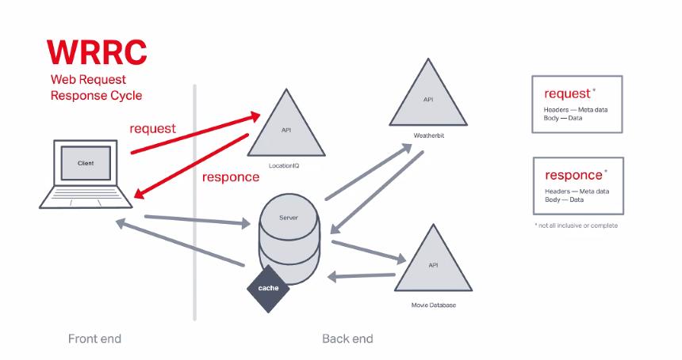
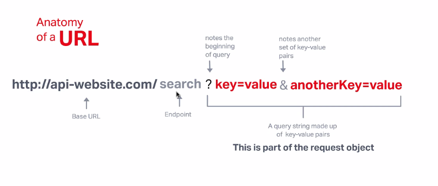

# Node.js

## Reading

* [Intro to Node.js](https://www.sitepoint.com/an-introduction-to-node-js)
* [6 Reasons for Pair Programming](https://www.codefellows.org/blog/6-reasons-for-pair-programming/)

## References

* [Geocoding API Docs](https://locationiq.com/)
* [Axios docs](https://www.npmjs.com/package/axios)
* [MDN async and await](https://developer.mozilla.org/en-US/docs/Learn/JavaScript/Asynchronous/Async_await)

## Questions

### Node.Js

* **What is node.js?**
  * A program that we can use to run JavaScript on our computers
  * Utilizes the V8 engine from Chrome-based browsers
  * Allows us to run JS outside of the browser
* **In your own words, what is Chrome’s V8 JavaScript Engine?**
  * JavaScript engine for Chrome-based browsers that compiles JS directly into machine code for computers to read
* **What does it that node is a JavaScript runtime?**
  * It complies JS code on our computers
* **What is npm?**
  * An open source package manager for Node.js
* **What version of node are you running on your machine?**
  * v18.9.0
* **What version of npm are you running on your machine?**
  * 8.19.1
* **What command would you type to install a library/package called ‘jshint’?**
  * `npm install -g jshint`
* **What is node used for?**
  * Run JavaScript on the server
  * Allows us to run JS outside of the browser

### Pair Programming

* **What are the 6 reasons for pair programming?**
  1. Greater efficiency
  2. Engaged collaboration
  3. Learning from fellow students
  4. Social skills
  5. Job interview readiness
  6. Work environment readiness
* **In your experience, which of these reasons have you found most beneficial?**
  * Engaged collaboration
  * It is a far better experience for me working as part of a team when solving these coding problems
* **How does pair programming work?**
  * One person "drives" the code (actually types)
  * One person "navigates" (tells the driver what to type)

## Notes

### Intro to Node.js

* [addNotes]

## In Class Notes

### Lab 6: API Calls

* Front-end = out computer
* Back-end = someone else's computer
* REST API
  * REpresentational State Transfer
  * Sends a snapshot of the state of the data at the time the request is sent
  * Commands
    * Get
    * Post
    * Delete
* API URL

* **KEY FOR THE LAB**
  * `async`
  * `await`
  * `.data`
* Process fro `GET`
  * Will need to create a event handler to handle the `GET` request and store the response in `state`
  * Add `Axios` to project
    * `npm install axios`
    * Verify install in `package.json`
* `async` & `await`
  * Tells JS to wait for the data to load into the event handler before moving on in the JS file
  * `async` goes with the event
  * `await` goes with the `GET` request
* With `axios` package, you will need to get the requested data by using `.data` to remove the data from the additional API wrapper that `axios` puts its response in
  * The API wrapper contains additional info for pagination
* Create a form with `submit` button
  * `submit` sends API request by activating our event handler function
* Store API Key info inside a `.env` file on the same level as the `.gitignore` file
  * Add `.env` to the `.gitignore` file
  * In `.env` file, create a variable for the API Key using the below syntax:
    * `REACT_APP_<DescriptiveName>`
      * Ex: `REACT_APP_LOCATIONIQ_API_KEY=pk.dlkajdklfj12903okasjedio`
    * Also, add `.env.sample` file with the following syntax for use by the TAs:
      * `REACT_APP_LOCATIONIQ_API_KEY=<you-api-key-here>`
  * **Note:** If you ever change a `.env` file, you will need to restart your server for the change to take effect
* Will need to also add a search box to the `form` to look for a city
  * Requires additional `event handler` to change the `state` of the app to include the entered city name
  * `handleCitySubmit` will handle submitting the name with form submissions
  * `handleCityInput` will update the `state` with every character input via an `onChange` property inside the `<input>` tag in the `<form>`
