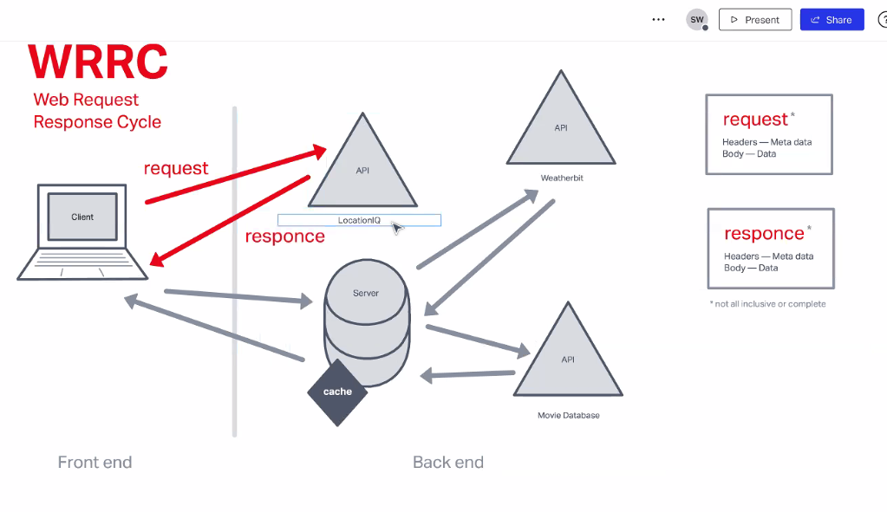

# API Design

## Readings

* [API Design Best Practices](https://docs.microsoft.com/en-us/azure/architecture/best-practices/api-design)

## References

* [RegExr](https://regexr.com/)
* [Regex Tutorial](https://medium.com/factory-mind/regex-tutorial-a-simple-cheatsheet-by-examples-649dc1c3f285)
* [Regex 101](https://regex101.com/)

## Questions

### API Design Best Practices

* **What does REST stand for?**
  * Representational State Transfer
* **REST APIs are designed around a ____.**
  * Resources, which are any kind of object, data, or service that can be accessed by the user's client
* **What is an identifier of a resource? Give an example.**
  * URI
  * `https://mywebsite.com/orders/1`
* **What are the most common HTTP verbs?**
  * `GET`
  * `POST`
  * `PUT`
  * `PATCH`
  * `DELETE`
* **What should the URIs be based on?**
  * The nouns of the resources, not verbs
* **Give an example of a good URI.**
  * `https://mywebsite.com/orders`
* **What does it mean to have a ‘chatty’ web API? Is this a good or a bad thing?**
  * It is an API that exposes a large number of small resources
  * This is bad since it will slow down performance
* **What status code does a successful `GET` request return?**
  * `200 (OK)`
* **What status code does an unsuccessful `GET` request return?**
  * `404 (Not Found)`
* **What status code does a successful `POST` request return?**
  * `201 (Created)`
* **What status code does a successful `DELETE` request return?**
  * `204 (No Content)`

## Notes

* TODO

## In Class Notes

### RegEx

* Can look at strings and tell us **if the string contains an *expected* pattern**
  * Good for phone numbers, emails, etc. that you are expecting as user inputs that follow a specific pattern
* Pair `RegEx` with `.test()` to return a `true` or `false` evaluation of the presence of the pattern
* Syntax
  * Set expected pattern in a separate variable with values surrounded by `//`
  
  ```js
  let regex = /ox/;

  let str = 'Fox jumps over the lazy dog';
  
  let hasPattern = regex.test(str);
  cosole.log(hasPattern); //returns `true`
  ```

* Can also pair wth `.match()` to extract the value that `RegEx` finds

### Lab 8: Adding API to Weather



* Need to write a handler on the backend in order to handle API requests for map images and movies associated with the search city
* Basic backend
  * REQUIRE

    ```js
    require('dotenv').config();
    const express = require('express');
    const cors = require('cors');
    ```
  
  * USE

    ```js
    app.use(cors());
    const PORT = process.env.PORT || 3002;
    ```

  * ROUTES

    ```js
    app.get('/', (request, response)) => {
      response.status(200).send('Server is running');
    };

    app.get('*', (request, response)) => {
      res.status(404).send('404: File Not Found');
    };
    ```
  
  * LISTEN
* Steps for integrating the API
  * Create new route for weather requests using API
  * Create new `.env` parameter in backend for weather API key `WEATHER_API_KEY=<key>`
  * Extract values from the request
  * Make an additional request to the weather API
  * Request URL: `<put-url-here>` for reference
  * Replace API key in request URL to `${process.env.<api-key-var-name>}`
  * Replace search parameter with user input `${searchVariable}`
  * Use `axios` to  make the request from the backed using the request URL
    * Remember to include `async`, `await`, and `.data`
  * Clean the data from the request
  * Send groomed data back to the front with the response
