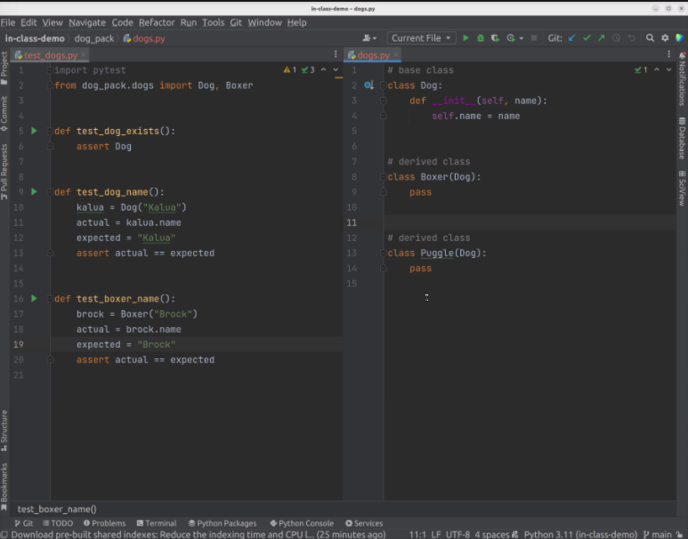
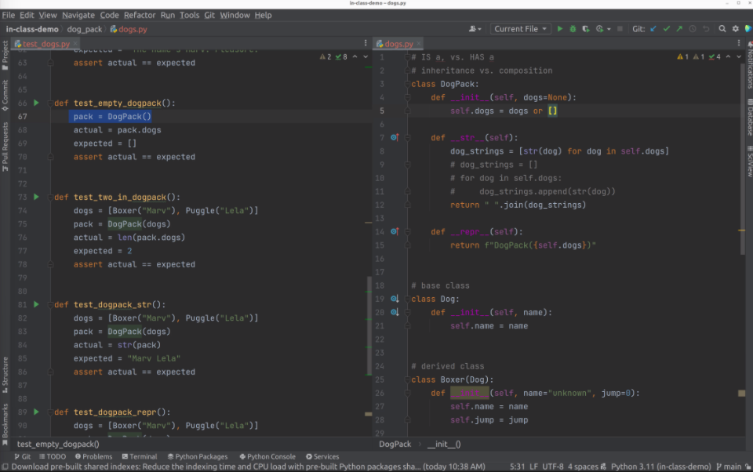

# In Class Notes: Classes & Objects

## Notes

### What is a class?

* A blueprint for creating objects in Python

### What is an object?

* Everything is an object in Python
* Python is an Object Oriented Programming Language

## Examples

* Initiate a new class
  * Requires a `__init__(self):` to initiate

```py
# base class
class Dog:
  def __init__(self, name):
    self.name = name

# derived class
class Boxer(Dog):
  pass

class Pug(Dog):
  pass
```

* Analogy to JS React
  * `self` is like the contextual `this`
    * `self` is inherent to the class, like `this`
    * It allows you to pull contextual information out of the class using .dot notation
  * By convention, `Class` is uppercase, just like in React
  * Instead of needing to write `extends` like in React, the `Class` is extended by being referenced inside another child class
    * `class Pug(Dog)` reads as "class Pug extends class Dog"

* Example tests



* Can tell Python what data type to return by using some built in **instance methods**:
  * `__str__` = returns string representation of an object
  * `__repr__` = returns the object representation in string format
    * i.e. it will return the 

```py
class Boxer(Dog):
  def __init__(self, name="unknown", jump=0):
    self.name = name
    self.jump = jump

  def __str__(self):
    return self.name
  # Will return self.name as a string
```


* Relationships
  * `Is a` vs `Has a`
  * For the lab:
    * A `Musician` **is a** musician and **has a** instrument
    * A `Band` **has a** collection of musicians

* Collections


