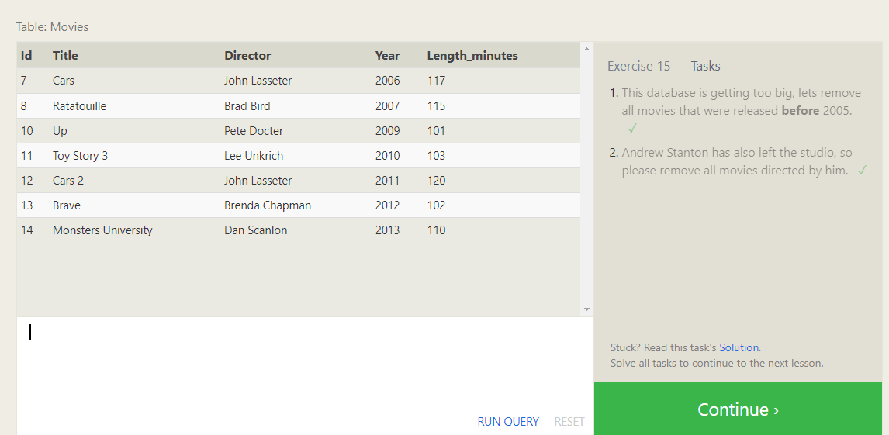

# Learn SQL

## References

* [Learn SQL](https://landing.chartio.com/download-learn-sql)
* [SQL Bolt](https://sqlbolt.com/)

## Notes

### Learn SQL

* SQL databases are composed of **tables**, columns and rows of data similar to a spreadsheet
* These tables all have relationships that can be defined by the user

### SQL Bolt

* Assignment
  * Lessons 1 through 6 - SQL Queries
  * Lessons 13 through 18 - Database Management

#### Basic Commands

* `SELECT`
  * Retrieves data from the database
  * `SELECT` defines the data to return
  * `FROM` defines the table to look inside
  * `*` selector will return all columns
  
  ```sql
  SELECT column, another_column, ...
  FROM mytable;
  ```

* `WHERE`
  * Adds **conditional logic** to query
  * Allows us to filter out unwanted data

  ```sql
  SELECT column, another_column, …
  FROM mytable
  WHERE condition
      AND/OR another_condition
      AND/OR …;
  ```
  
  | **Operator** |	**Condition** |	**SQL Example** |
  | --- | --- | --- |
  | =, !=, < <=, >, >=	| Standard numerical operators	| col_name != 4 |
  | BETWEEN … AND …	| Number is within range of two values (inclusive)	| col_name BETWEEN 1.5 AND 10.5 |
  | NOT BETWEEN … AND …	| Number is not within range of two values (inclusive)	| col_name NOT BETWEEN 1 AND 10 |
  | IN (…)	| Number exists in a list	| col_name IN (2, 4, 6) |
  | NOT IN (…)	| Number does not exist in a list |	col_name NOT IN (1, 3, 5) |
  | =	| Case sensitive exact string comparison (notice the single equals)	| col_name = "abc" |
  | != or <>	| Case sensitive exact string inequality comparison	| col_name != "abcd" |
  | LIKE	| Case insensitive exact string comparison	| col_name LIKE "ABC" |
  | NOT LIKE	| Case insensitive exact string inequality comparison	| col_name NOT LIKE "ABCD" |
  | %	| Used anywhere in a string to match a sequence of zero or more characters (only with LIKE or NOT LIKE) |	col_name LIKE "%AT%" (matches "AT", "ATTIC", "CAT" or even "BATS") |
  | _	| Used anywhere in a string to match a single character (only with LIKE or NOT LIKE) |	col_name LIKE "AN_" (matches "AND", but not "AN") |
  | IN (…)	| String exists in a list	| col_name IN ("A", "B", "C") |
  | NOT IN (…) |	String does not exist in a list	| col_name NOT IN ("D", "E", "F") |

* `DISTINCT`
  * Removes duplicate values

  ```sql
  SELECT DISTINCT column, another_column, …
  FROM mytable
  WHERE condition(s);
  ```

* `ORDER BY`
  * Sorts data in specified order

  ```sql
  SELECT column, another_column, …
  FROM mytable
  WHERE condition(s)
  ORDER BY column ASC/DESC;
  ```

* `LIMIT` / `OFFSET`
  * `LIMIT` reduces the number of rows to return
  * `OFFSET` specifies where to begin counting the number of rows from

  ```sql
  SELECT column, another_column, …
  FROM mytable
  WHERE condition(s)
  ORDER BY column ASC/DESC
  LIMIT num_limit OFFSET num_offset;
  ```

* Multi-table queries with JOINs
  * In order to answer questions about an entity that has data spanning multiple tables in a normalized database, we need to learn how to **write a query that can combine all that data and pull out exactly the information we need.**
  * `INNER JOIN`
    * Matches rows from teh first table and the second table which have the same key (as defined by the **ON** constraint) to create a new result row with the combined columns from both tables

  ```sql
  SELECT column, another_table_column, …
  FROM mytable
  INNER JOIN another_table 
      ON mytable.id = another_table.id
  WHERE condition(s)
  ORDER BY column, … ASC/DESC
  LIMIT num_limit OFFSET num_offset;
  ```

* `INSERT`
  * Inserts rows into table
  * Can insert into all columns or add specific columns as defined in the query

  ```sql
  INSERT INTO mytable
  (column, another_column, …)
  VALUES (value_or_expr, another_value_or_expr, …),
        (value_or_expr_2, another_value_or_expr_2, …),
        …;
  ```

* `UPDATE`
  * Updates the values within a table
  
  ```sql
  UPDATE mytable
  SET column = value_or_expr, 
      other_column = another_value_or_expr, 
      …
  WHERE condition;
  ```
* `DELETE`
  * Deletes rows in specific columns with or without criteria

  ```sql
  DELETE FROM mytable
  WHERE condition;
  ```
* `CREATE TABLE`
  * Creates a new table to store in the database

  ```sql
  CREATE TABLE IF NOT EXISTS mytable (
    column DataType TableConstraint DEFAULT default_value,
    another_column DataType TableConstraint DEFAULT default_value,
    …
  );
  ```

  * Table Data Types

    | **Data type** |	**Description** |
    | --- | --- |
    | **INTEGER, BOOLEAN** |	The integer datatypes can store whole integer values like the count of a number or an age. In some implementations, the boolean value is just represented as an integer value of just 0 or 1. |
    | **FLOAT, DOUBLE, REAL** |	The floating point datatypes can store more precise numerical data like measurements or fractional values. Different types can be used depending on the floating point precision required for that value. |
    | **CHARACTER(num_chars), VARCHAR(num_chars), TEXT** | The text based datatypes can store strings and text in all sorts of locales. The distinction between the various types generally amount to underlaying efficiency of the database when working with these columns. Both the CHARACTER and VARCHAR (variable character) types are specified with the max number of characters that they can store (longer values may be truncated), so can be more efficient to store and query with big tables. |
    | **DATE, DATETIME** | SQL can also store date and time stamps to keep track of time series and event data. They can be tricky to work with especially when manipulating data across timezones. |
    | **BLOB** |	Finally, SQL can store binary data in blobs right in the database. These values are often opaque to the database, so you usually have to store them with the right metadata to requery them. |

* Table Constraints

  | **Constraint** |	**Description** |
  | --- | --- |
  | **PRIMARY KEY** |	This means that the values in this column are unique, and each value can be used to identify a single row in this table. |
  | **AUTOINCREMENT** |	For integer values, this means that the value is automatically filled in and incremented with each row insertion. Not supported in all databases. |
  | **UNIQUE** | This means that the values in this column have to be unique, so you can't insert another row with the same value in this column as another row in the table. Differs from the `PRIMARY KEY` in that it doesn't have to be a key for a row in the table. |
  | **NOT NULL** |	This means that the inserted value can not be `NULL`. |
  | **CHECK (expression)** |	This allows you to run a more complex expression to test whether the values inserted are valid. For example, you can check that values are positive, or greater than a specific size, or start with a certain prefix, etc. |
  | **FOREIGN KEY** |	This is a consistency check which ensures that each value in this column corresponds to another value in a column in another table. For example, if there are two tables, one listing all Employees by ID, and another listing their payroll information, the `FOREIGN KEY` can ensure that every row in the payroll table corresponds to a valid employee in the master Employee list. |

* `ALTER TABLE`
  * Used to preface commands to modify the table
  * `ADD`
    * Adds columns to the table

    ```sql
    ALTER TABLE mytable
    ADD column DataType OptionalTableConstraint 
      DEFAULT default_value;
    ```
  * `DROP`
    * Deletes a column

    ```sql
    ALTER TABLE mytable
    DROP column_to_be_deleted;
    ```
  
  * `RENAME`
    * Changes a column header

    ```sql
    ALTER TABLE mytable
    RENAME TO new_table_name;
    ```
* `DROP TABLE`
  * Removes an entire table given certain criteria

  ```sql
  DROP TABLE IF EXISTS mytable;
  ```

#### Screenshots





