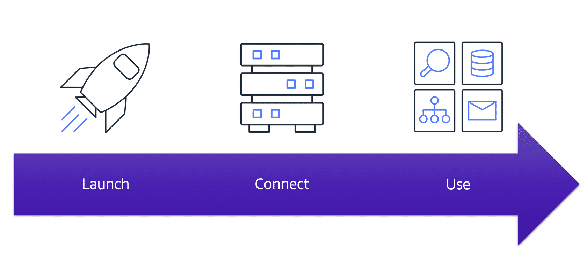
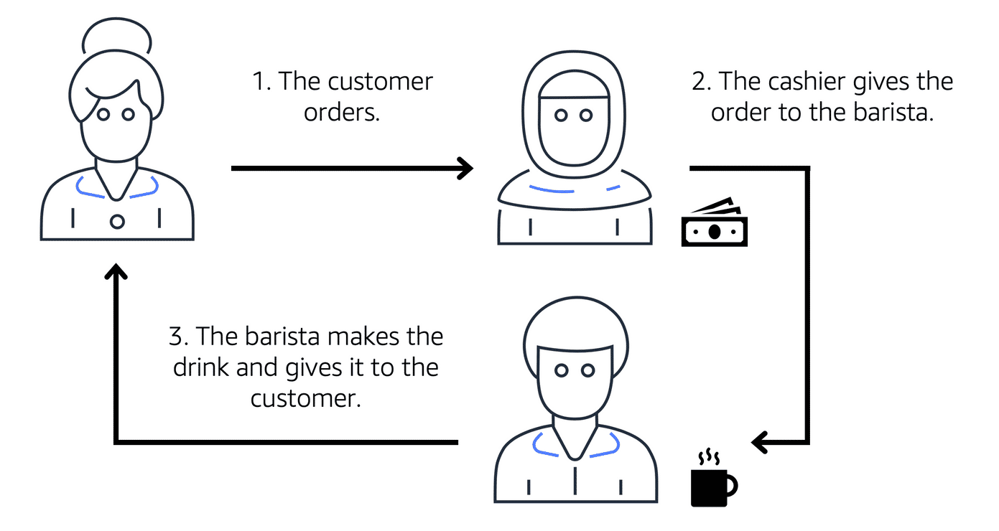
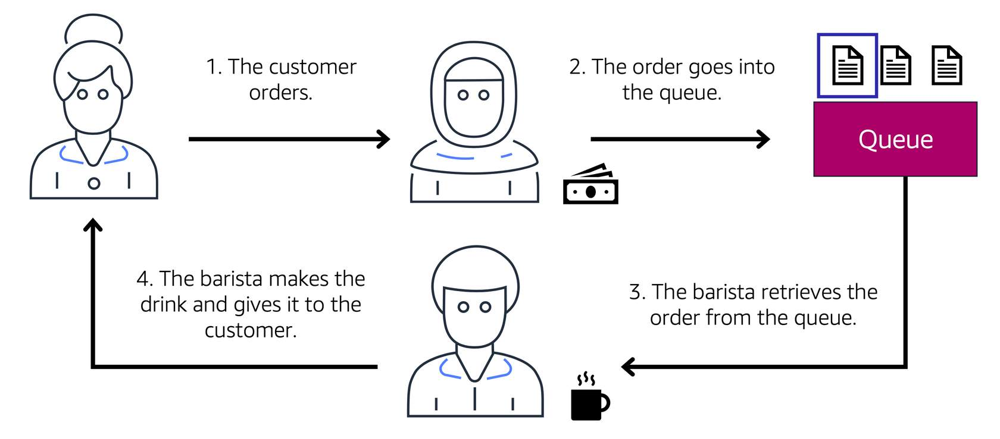

# AWS Cloud Practitioner Essentials: Compute in the Cloud

## Resources

* [Compute on AWS](https://aws.amazon.com/products/compute)
* [AWS Compute Blog](https://aws.amazon.com/blogs/compute/)
* [AWS Compute Services](https://docs.aws.amazon.com/whitepapers/latest/aws-overview/compute-services.html)
* [Hands-On Tutorials: Compute](https://aws.amazon.com/getting-started/hands-on/?awsf.getting-started-category=category%23compute&awsf.getting-started-content-type=content-type%23hands-on)
* [Category Deep Dive: Serverless](https://aws.amazon.com/getting-started/deep-dive-serverless/)
* [AWS Customer Stories: Serverless](https://aws.amazon.com/solutions/case-studies/?customer-references-cards.sort-by=item.additionalFields.publishedDate&customer-references-cards.sort-order=desc&awsf.customer-references-location=*all&awsf.customer-references-segment=*all&awsf.customer-references-product=product%23vpc%7Cproduct%23api-gateway%7Cproduct%23cloudfront%7Cproduct%23route53%7Cproduct%23directconnect%7Cproduct%23elb&awsf.customer-references-category=category%23serverless)

## Summary

* Amazon Elastic Compute Cloud (**EC2** ) is how you gain access to virtual servers hosted by AWS
* AWS is constantly operating a massive amount of compute capacity. And you can use whatever portion of that capacity, when you need it
* All you have to do is request the EC2 instances you want, and they will launch and boot up, ready to be used within a few minutes
* Once you're done, you can easily stop or terminate the EC2 instances
* When you spin up an EC2 instance, you weren't necessarily taking an entire host to yourself. Instead, you are sharing the host, with multiple other instances, otherwise known as virtual machines. And a hypervisor running on the host machine is responsible for sharing the underlying physical resources between the virtual machines.
* This idea of sharing underlying hardware is called **multitenancy**
  * The hypervisor is responsible for coordinating this multitenancy and it is managed by AWS
  * The hypervisor is responsible for isolating the virtual machines from each other as they share resources from the host
    * Therefore, EC2 instances are not aware of any other EC2 instance operating on the same host
* When you provision an EC2 instance, you can choose the operating system based on either Windows or Linux

### [Amazon Elastic Compute Cloud (EC2)](https://aws.amazon.com/ec2/)

Amazon Elastic Compute Cloud (Amazon EC2) provides secure, resizable compute capacity in the cloud as Amazon EC2 instances. 

Imagine you are responsible for the architecture of your company's resources and need to support new websites. With traditional on-premises resources, you have to do the following:

* Spend money upfront to purchase hardware.
* Wait for the servers to be delivered to you.
* Install the servers in your physical data center.
* Make all the necessary configurations.

By comparison, with an Amazon EC2 instance you can use a virtual server to run applications in the AWS Cloud.

* You can provision and launch an Amazon EC2 instance within minutes.
* You can stop using it when you have finished running a workload.
* You pay only for the compute time you use when an instance is running, not when it is stopped or terminated.
* You can save costs by paying only for server capacity that you need or want.

**How EC2 Works**

**Launch**

First, you launch an instance. Begin by selecting a template with basic configurations for your instance. These configurations include the operating system, application server, or applications. You also select the instance type, which is the specific hardware configuration of your instance. 

As you are preparing to launch an instance, you specify security settings to control the network traffic that can flow into and out of your instance. Later in this course, we will explore Amazon EC2 security features in greater detail.

**Connect**

Next, connect to the instance. You can connect to the instance in several ways. Your programs and applications have multiple different methods to connect directly to the instance and exchange data. Users can also connect to the instance by logging in and accessing the computer desktop.

**Use**

After you have connected to the instance, you can begin using it. You can run commands to install software, add storage, copy and organize files, and more.

### [Amazon EC2 Instance Types](https://aws.amazon.com/ec2/instance-types/)

* Each instance type is grouped under an instance family that is optimized for certain types of tasks
  * Various combinations of CPU, memory, storage, and networking capacity
* Instance Families
  * **General Purpose**
    * Balanced resources
    * Diverse workloads
    * Web servers
    * Code Repositories
  * **Compute Optimized**
    * Ideal for compute intensive tasks
    * Gaming servers
    * High performance computing (HPC)
    * Scientific modeling
  * **Memory Optimized**
    * Memory intensive tasks
  * **Accelerated Computing**
    * Floating point number calculations
    * Graphic processing
    * Data pattern matching
    * Utilize hardware accelerators
  * **Storage Optimized**
    * High performance for locally stored data

### Pricing

* **On Demand**
  * Only pay for the duration that the instance runs for
    * Can be on a per hour or per second basis based on requirements
  * No long term commitments or upfront payments
  * Good for testing and getting a baseline for requirements
* **Savings Plan**
  * Low price with commitment to a minimum use set in dollars / hour for a 1 or 3 year term
  * Can lower cost by up to 72%
* **Reserved Instances**
  * Steady state workloads
  * Up to 75% discount to On Demand pricing once committed to a 1 or 3 year term
  * Payment must be made using one of the three options below:
    * Up front
    * Partial up front
    * No up front
* **Spot Instances**
  * Allow you to request spare Amazon EC2 computing capacity for up to 90% of On Demand pricing
  * Amazon can reclaim the instance at any time, giving you a 2-minute warning to finish up and save state
  * Ok for batch workloads were work can be interrupted
* **Dedicated Hosts**
  * Physical host dedicated to your use for EC2
  * No one else will share the instance

### Scaling EC2

**Scalability**

Scalability involves beginning with only the resources you need and designing your architecture to automatically respond to changing demand by scaling out or in. As a result, you pay for only the resources you use. You don’t have to worry about a lack of computing capacity to meet your customers’ needs.

If you wanted the scaling process to happen automatically, which AWS service would you use? The AWS service that provides this functionality for Amazon EC2 instances is **Amazon EC2 Auto Scaling**.

**Amazon EC2 Auto Scaling**

If you’ve tried to access a website that wouldn’t load and frequently timed out, the website might have received more requests than it was able to handle. This situation is similar to waiting in a long line at a coffee shop, when there is only one barista present to take orders from customers.

Amazon EC2 Auto Scaling enables you to **automatically add or remove Amazon EC2 instances in response to changing application demand.** By automatically scaling your instances in and out as needed, you are able to maintain a greater sense of application availability.

Within Amazon EC2 Auto Scaling, you can use two approaches: **dynamic scaling** and **predictive scaling**.

* *Dynamic scaling* responds to changing demand. 
* *Predictive scaling* automatically schedules the right number of Amazon EC2 instances based on predicted demand.

In the cloud, computing power is a programmatic resource, so you can take a more flexible approach to the issue of scaling. By adding Amazon EC2 Auto Scaling to an application, you can add new instances to the application when necessary and terminate them when no longer needed.

Suppose that you are preparing to launch an application on Amazon EC2 instances. When configuring the size of your Auto Scaling group, you might set the minimum number of Amazon EC2 instances at one. This means that at all times, there must be at least one Amazon EC2 instance running.

When you create an Auto Scaling group, you can set the minimum number of Amazon EC2 instances. The **minimum capacity** is the **number of Amazon EC2 instances that launch immediately after you have created the Auto Scaling group**. In this example, the Auto Scaling group has a minimum capacity of one Amazon EC2 instance.

Next, you can set the **desired capacity** at two Amazon EC2 instances even though your application needs a minimum of a single Amazon EC2 instance to run.

Note: If you do not specify the desired number of Amazon EC2 instances in an Auto Scaling group, the desired capacity defaults to your minimum capacity.

The third configuration that you can set in an Auto Scaling group is the **maximum capacity**. For example, you might configure the Auto Scaling group to scale out in response to increased demand, but only to a maximum of four Amazon EC2 instances.

Because Amazon EC2 Auto Scaling uses Amazon EC2 instances, **you pay for only the instances you use, when you use them.** You now have a cost-effective architecture that provides the best customer experience while reducing expenses.

### Directing Traffic with Elastic Load Balancing

* A load balancer is an application, takes in requests and routes them to the instances to be processed
  * Keeps incoming traffic from bogging down any one EC2 instance

Elastic Load Balancing is the AWS service that automatically distributes incoming application traffic across multiple resources, such as Amazon EC2 instances. 

A load balancer acts as a single point of contact for all incoming web traffic to your Auto Scaling group. This means that as you add or remove Amazon EC2 instances in response to the amount of incoming traffic, these requests route to the load balancer first. Then, the requests spread across multiple resources that will handle them. For example, if you have multiple Amazon EC2 instances, Elastic Load Balancing distributes the workload across the multiple instances so that no single instance has to carry the bulk of it. 

Although Elastic Load Balancing and Amazon EC2 Auto Scaling are separate services, they work together to help ensure that applications running in Amazon EC2 can provide high performance and availability. 

Example: Elastic Load Balancing

**Low-demand period**

Here’s an example of how Elastic Load Balancing works. Suppose that a few customers have come to the coffee shop and are ready to place their orders. 

If only a few registers are open, this matches the demand of customers who need service. The coffee shop is less likely to have open registers with no customers. In this example, you can think of the registers as Amazon EC2 instances.

**High-demand period**

Throughout the day, as the number of customers increases, the coffee shop opens more registers to accommodate them. In the diagram, the Auto Scaling group represents this.

Additionally, a coffee shop employee directs customers to the most appropriate register so that the number of requests can evenly distribute across the open registers. You can think of this coffee shop employee as a load balancer. 

### Monolithic Applications and Microservices

**Monolithic Applications**

Applications are made of multiple components. The components communicate with each other to transmit data, fulfill requests, and keep the application running. 

Suppose that you have an application with tightly coupled components. These components might include databases, servers, the user interface, business logic, and so on. This type of architecture can be considered a **monolithic application.** 

In this approach to application architecture, if a single component fails, other components fail, and possibly the entire application fails.

**Microservices**

To help maintain application availability when a single component fails, you can design your application through a **microservices** approach.

In a microservices approach, application components are loosely coupled. In this case, if a single component fails, the other components continue to work because they are communicating with each other. The loose coupling prevents the entire application from failing. 

When designing applications on AWS, you can take a microservices approach with services and components that fulfill different functions. Two services facilitate application integration: Amazon Simple Notification Service (Amazon SNS) and Amazon Simple Queue Service (Amazon SQS).

### Amazon Simple Notification Service (Amazon SNS)

Amazon Simple Notification Service (Amazon SNS) is a publish/subscribe service. Using Amazon SNS topics, a publisher publishes messages to subscribers. This is similar to the coffee shop; the cashier provides coffee orders to the barista who makes the drinks.

In Amazon SNS, subscribers can be web servers, email addresses, AWS Lambda functions, or several other options. 

**Publishing updates from a single topic**

Suppose that the coffee shop has a single newsletter that includes updates from all areas of its business. It includes topics such as coupons, coffee trivia, and new products. All of these topics are grouped because this is a single newsletter. All customers who subscribe to the newsletter receive updates about coupons, coffee trivia, and new products.

After a while, some customers express that they would prefer to receive separate newsletters for only the specific topics that interest them. The coffee shop owners decide to try this approach.

**Publishing updates from multiple topics**

Now, instead of having a single newsletter for all topics, the coffee shop has broken it up into three separate newsletters. Each newsletter is devoted to a specific topic: coupons, coffee trivia, and new products.

Subscribers will now receive updates immediately for only the specific topics to which they have subscribed.

It is possible for subscribers to subscribe to a single topic or to multiple topics. For example, the first customer subscribes to only the coupons topic, and the second subscriber subscribes to only the coffee trivia topic. The third customer subscribes to both the coffee trivia and new products topics.

### Amazon Simple Queue Service (Amazon SQS)

Amazon Simple Queue Service (Amazon SQS) is a message queuing service. 

Using Amazon SQS, you can send, store, and receive messages between software components, without losing messages or requiring other services to be available. In Amazon SQS, an application sends messages into a queue. A user or service retrieves a message from the queue, processes it, and then deletes it from the queue.

**Example: Fulfilling an order**

Suppose that the coffee shop has an ordering process in which a cashier takes orders, and a barista makes the orders. Think of the cashier and the barista as two separate components of an application. 

First, the cashier takes an order and writes it down on a piece of paper. Next, the cashier delivers the paper to the barista. Finally, the barista makes the drink and gives it to the customer.

When the next order comes in, the process repeats. This process runs smoothly as long as both the cashier and the barista are coordinated.

What might happen if the cashier took an order and went to deliver it to the barista, but the barista was out on a break or busy with another order? The cashier would need to wait until the barista is ready to accept the order. This would cause delays in the ordering process and require customers to wait longer to receive their orders.

As the coffee shop has become more popular and the ordering line is moving more slowly, the owners notice that the current ordering process is time consuming and inefficient. They decide to try a different approach that uses a queue.

**Example: Orders in a queue**

Recall that the cashier and the barista are two separate components of an application. A message queuing service such as Amazon SQS enables messages between decoupled application components.

In this example, the first step in the process remains the same as before: a customer places an order with the cashier. 

The cashier puts the order into a queue. You can think of this as an order board that serves as a buffer between the cashier and the barista. Even if the barista is out on a break or busy with another order, the cashier can continue placing new orders into the queue.

Next, the barista checks the queue and retrieves the order.

The barista prepares the drink and gives it to the customer. 

The barista then removes the completed order from the queue. 

While the barista is preparing the drink, the cashier is able to continue taking new orders and add them to the queue.

### Serverless Compute Services

* Serverless: cannot see the underlying infrastructure of your application

If you have applications that you want to run in Amazon EC2, you must do the following:

* Provision instances (virtual servers).
* Upload your code.
* Continue to manage the instances while your application is running.

The term “serverless” means that your code runs on servers, but you do not need to provision or manage these servers. With serverless computing, you can focus more on innovating new products and features instead of maintaining servers.

Another benefit of serverless computing is the flexibility to scale serverless applications automatically. Serverless computing can adjust the applications' capacity by modifying the units of consumptions, such as throughput and memory. 

An AWS service for serverless computing is AWS Lambda.

**AWS Lambda**

[AWS Lambda](https://aws.amazon.com/lambda) is a service that lets you run code without needing to provision or manage servers. 

While using AWS Lambda, you pay only for the compute time that you consume. Charges apply only when your code is running. You can also run code for virtually any type of application or backend service, all with zero administration. 

For example, a simple Lambda function might involve automatically resizing uploaded images to the AWS Cloud. In this case, the function triggers when uploading a new image. 

**How AWS Lambda works**

* You upload your code to Lambda. 
* You set your code to trigger from an event source, such as AWS services, mobile applications, or HTTP endpoints.
* Lambda runs your code only when triggered.
* You pay only for the compute time that you use. In the previous example of resizing images, you would pay only for the compute time that you use when uploading new images. Uploading the images triggers Lambda to run code for the image resizing function.

**Containers**

In AWS, you can also build and run containerized applications.

Containers provide you with a standard way to package your application's code and dependencies into a single object. You can also use containers for processes and workflows in which there are essential requirements for security, reliability, and scalability.

Examples:
**One host with multiple containers**

Suppose that a company’s application developer has an environment on their computer that is different from the environment on the computers used by the IT operations staff. The developer wants to ensure that the application’s environment remains consistent regardless of deployment, so they use a containerized approach. This helps to reduce time spent debugging applications and diagnosing differences in computing environments.

**Tens of hosts with hundreds of containers**

When running containerized applications, it’s important to consider scalability. Suppose that instead of a single host with multiple containers, you have to manage tens of hosts with hundreds of containers. Alternatively, you have to manage possibly hundreds of hosts with thousands of containers. At a large scale, imagine how much time it might take for you to monitor memory usage, security, logging, and so on.

**Amazon Elastic Container Service (Amazon ECS)**

[Amazon Elastic Container Service (Amazon ECS)](https://aws.amazon.com/ecs/) is a highly scalable, high-performance container management system that enables you to run and scale containerized applications on AWS. 

Amazon ECS supports [Docker](https://www.docker.com/) containers. Docker is a software platform that enables you to build, test, and deploy applications quickly. AWS supports the use of open-source Docker Community Edition and subscription-based Docker Enterprise Edition. With Amazon ECS, you can use API calls to launch and stop Docker-enabled applications.
