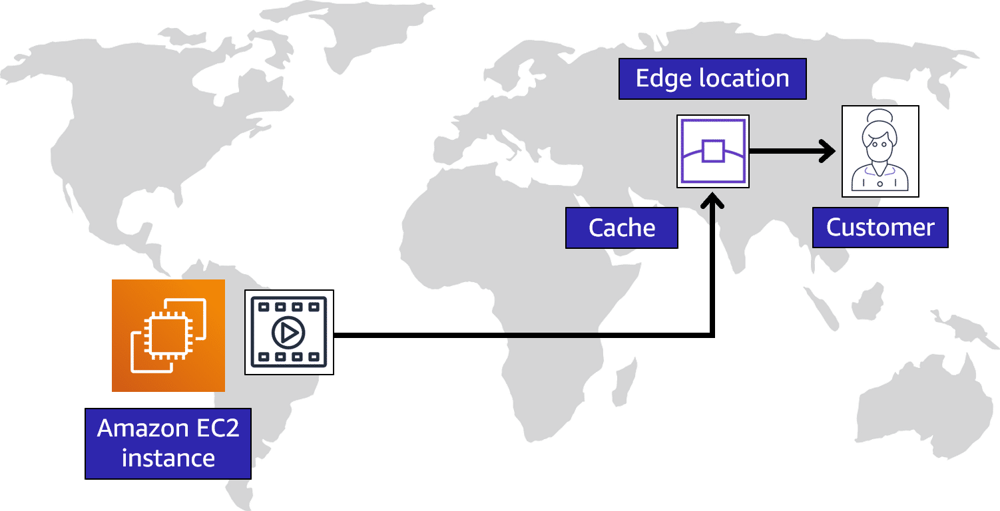

# AWS Cloud Practitioner Essentials: AWS Global Infrastructure and Reliability

## Resources

* [Global Infrastructure](https://aws.amazon.com/about-aws/global-infrastructure/)
* [Interactive map of the AWS Global Infrastructure](https://www.infrastructure.aws/)
* [Regions and Availability Zones](https://aws.amazon.com/about-aws/global-infrastructure/regions_az)
* [AWS Networking and Content Delivery Blog](https://aws.amazon.com/blogs/networking-and-content-delivery/)
* [Tools to Build on AWS](https://aws.amazon.com/tools/)
* [AWS Customer Stories: Content Delivery](https://aws.amazon.com/solutions/case-studies/?customer-references-cards.sort-by=item.additionalFields.publishedDate&customer-references-cards.sort-order=desc&awsf.customer-references-location=*all&awsf.customer-references-segment=*all&awsf.customer-references-product=product%23vpc%7Cproduct%23api-gateway%7Cproduct%23cloudfront%7Cproduct%23route53%7Cproduct%23directconnect%7Cproduct%23elb&awsf.customer-references-category=category%23content-delivery)

## Notes

### Regions

* AWS builds regions where there is the expected highest business traffic
* You get to choose the region that you belong to
* Data doesn't move from one region to another without your permission
* 4 Business Factors for Selecting a Region:
  1. Compliance with data governance and legal requirements
  2. Proximity to your customers
     * Reduce latency
  3. Feature Availability / Available services within a Region
     * Not all features are available in each region
  4. Pricing
     * Some locations are more or less expensive than others

### Availability Zones

* AWS refers to a single data center as an **Availability Zone (AZ)**
* Each regin consists of multiple AZs
* Recommend running at least two EC2 instances in two different AZs for redundancy

An Availability Zone is a single data center or a group of data centers within a Region. Availability Zones are located tens of miles apart from each other. This is close enough to have low latency (the time between when content requested and received) between Availability Zones. However, if a disaster occurs in one part of the Region, they are distant enough to reduce the chance that multiple Availability Zones are affected.

### Edge Locations

An **edge location** is a site that Amazon CloudFront uses to store cached copies of your content closer to your customers for faster delivery.

**Origin**

Suppose that your company’s data is stored in Brazil, and you have customers who live in China. To provide content to these customers, you don’t need to move all the content to one of the Chinese Regions.

**Edge Location**

Instead of requiring your customers to get their data from Brazil, you can cache a copy locally at an edge location that is close to your customers in China.

**Customer**

When a customer in China requests one of your files, Amazon CloudFront retrieves the file from the cache in the edge location and delivers the file to the customer. The file is delivered to the customer faster because it came from the edge location near China instead of the original source in Brazil.

### How to Provision AWS Resources

* At AWS, everything is an **API call**
* Done through:
  * **AWS Management Console**

    The AWS Management Console is a web-based interface for accessing and managing AWS services. You can quickly access recently used services and search for other services by name, keyword, or acronym. The console includes wizards and automated workflows that can simplify the process of completing tasks.

    You can also use the AWS Console mobile application to perform tasks such as monitoring resources, viewing alarms, and accessing billing information. Multiple identities can stay logged into the AWS Console mobile app at the same time.

  * **AWS Command Line Interface (CLI)**

    To save time when making API requests, you can use the AWS Command Line Interface (AWS CLI). AWS CLI enables you to control multiple AWS services directly from the command line within one tool. AWS CLI is available for users on Windows, macOS, and Linux. 

    By using AWS CLI, you can automate the actions that your services and applications perform through scripts. For example, you can use commands to launch an Amazon EC2 instance, connect an Amazon EC2 instance to a specific Auto Scaling group, and more.

  * **AWS Software Development Kit (SDK)**

    Another option for accessing and managing AWS services is the software development kits (SDKs). SDKs make it easier for you to use AWS services through an API designed for your programming language or platform. SDKs enable you to use AWS services with your existing applications or create entirely new applications that will run on AWS.

    To help you get started with using SDKs, AWS provides documentation and sample code for each supported programming language. Supported programming languages include C++, Java, .NET, and more.

  * **AWS Elastic Beanstalk**

    With AWS Elastic Beanstalk, you provide code and configuration settings, and Elastic Beanstalk deploys the resources necessary to perform the following tasks:
    * Adjust capacity
    * Load balancing
    * Automatic scaling
    * Application health monitoring
  
  * **AWS CloudFormation**

    With AWS CloudFormation, you can treat your infrastructure as code. This means that you can build an environment by writing lines of code instead of using the AWS Management Console to individually provision resources.

    AWS CloudFormation provisions your resources in a safe, repeatable manner, enabling you to frequently build your infrastructure and applications without having to perform manual actions or write custom scripts. It determines the right operations to perform when managing your stack and rolls back changes automatically if it detects errors.
