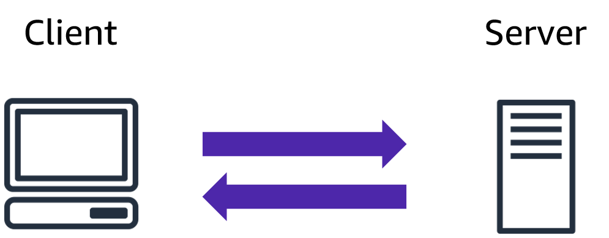

# AWS Cloud Practitioner Essentials: Intro to AWS

These notes are from the [Coursera](https://www.coursera.org/learn/aws-cloud-practitioner-essentials/) preparation course for the [AWS Cloud Practitioner Exam](https://aws.amazon.com/training/learn-about/cloud-practitioner/?th=tile&tile=learnabout).

Check the [Ramp Up Guide](https://d1.awsstatic.com/training-and-certification/ramp-up_guides/Ramp-Up_Guide_CloudPractitioner.pdf) for additional material

See this [article](https://towardsdatascience.com/how-to-become-an-aws-certified-cloud-practitioner-in-10-days-83a08e316e72) for tips to be exam ready in 10 days!

## Resources

* [AWS glossary](https://docs.aws.amazon.com/general/latest/gr/glos-chap.html)
* [Whitepaper: Overview of Amazon Web Services](https://d0.awsstatic.com/whitepapers/aws-overview.pdf)
* [AWS Fundamentals: Overview](https://aws.amazon.com/getting-started/fundamentals-overview/)
* [What is cloud computing?](https://aws.amazon.com/what-is-cloud-computing/)
* [Types of cloud computing](https://aws.amazon.com/types-of-cloud-computing/)
* [Cloud computing with AWS](https://aws.amazon.com/what-is-aws/)

### What is Cloud Computing?

* Cloud computing in the **on-demand delivery of IT resources** over the internet with **pay-as-you-go** pricing
  * AWS has the resources you need when you need them; **just start or stop using the service**
  * Pay for what you use *when* you use it

### What is a Client-Server model?

In computing, a **client** can be a web browser or desktop application that a person interacts with to make requests to computer servers.

A **server** can be services such as Amazon Elastic Compute Cloud (Amazon EC2), a type of virtual server.

For example, suppose that a client makes a request for a news article, the score in an online game, or a funny video. The server evaluates the details of this request and fulfills it by returning the information to the client.

### Deployment Models for Cloud Computing

When selecting a cloud strategy, a company must consider factors such as required cloud application components, preferred resource management tools, and any legacy IT infrastructure requirements.

The three cloud computing deployment models are cloud-based, on-premises, and hybrid. 

**Cloud-based Deployment**

Run all parts of the application in the cloud.

Migrate existing applications to the cloud.

Design and build new applications in the cloud.

In a cloud-based deployment model, you can migrate existing applications to the cloud, or you can design and build new applications in the cloud. You can build those applications on low-level infrastructure that requires your IT staff to manage them. Alternatively, you can build them using higher-level services that reduce the management, architecting, and scaling requirements of the core infrastructure.

For example, a company might create an application consisting of virtual servers, databases, and networking components that are fully based in the cloud.

**On-premises Deployment**

Deploy resources by using virtualization and resource management tools.

Increase resource utilization by using application management and virtualization technologies.

On-premises deployment is also known as a private cloud deployment. In this model, resources are **deployed on premises by using virtualization and resource management tools.**

For example, you might have applications that run on technology that is fully kept in your on-premises data center. Though this model is much like legacy IT infrastructure, its incorporation of application management and virtualization technologies helps to increase resource utilization.

**Hybrid Deployment**

Connect cloud-based resources to on-premises infrastructure.

Integrate cloud-based resources with legacy IT applications.

In a hybrid deployment, cloud-based resources are connected to on-premises infrastructure. You might want to use this approach in a number of situations. For example, you have **legacy applications that are better maintained on premises, or government regulations require your business to keep certain records on premises.**

For example, suppose that a company wants to use cloud services that can automate batch data processing and analytics. However, the company has several legacy applications that are more suitable on premises and will not be migrated to the cloud. With a hybrid deployment, the company would be able to keep the legacy applications on premises while benefiting from the data and analytics services that run in the cloud.

### Benefits of Cloud Computing

Consider why a company might choose to take a particular cloud computing approach when addressing business needs.

**Trade upfront expense for variable expense**

Upfront expense refers to data centers, physical servers, and other resources that you would need to invest in before using them. Variable expense means you only pay for computing resources you consume instead of investing heavily in data centers and servers before you know how you’re going to use them.

By taking a cloud computing approach that offers the benefit of variable expense, companies can implement innovative solutions while saving on costs.

**Stop spending money to run and maintain data centers**

Computing in data centers often requires you to spend more money and time managing infrastructure and servers. A benefit of cloud computing is the ability to focus less on these tasks and more on your applications and customers.

**Stop guessing capacity**

With cloud computing, you don’t have to predict how much infrastructure capacity you will need before deploying an application. For example, you can launch Amazon EC2 instances when needed, and pay only for the compute time you use. Instead of paying for unused resources or having to deal with limited capacity, you can access only the capacity that you need. You can also scale in or scale out in response to demand.

**Benefit from massive economies of scale**

By using cloud computing, you can achieve a lower variable cost than you can get on your own. Because usage from hundreds of thousands of customers can aggregate in the cloud, providers, such as AWS, can achieve higher economies of scale. The economy of scale translates into lower pay-as-you-go prices. 

**Increase speed and agility**

The flexibility of cloud computing makes it easier for you to develop and deploy applications.

This flexibility provides you with more time to experiment and innovate. When computing in data centers, it may take weeks to obtain new resources that you need. By comparison, cloud computing enables you to access new resources within minutes.

**Go global in minutes**

The global footprint of the AWS Cloud enables you to deploy applications to customers around the world quickly, while providing them with low latency. This means that even if you are located in a different part of the world than your customers, customers are able to access your applications with minimal delays.
