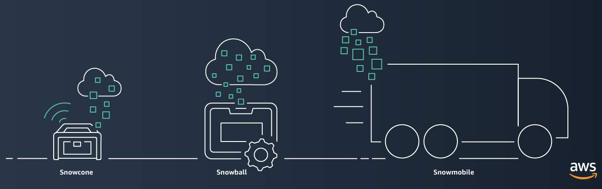

# AWS Cloud Practitioner Essentials: Migration and Innovation

## Resources

[Migration & Transfer on AWS](https://aws.amazon.com/products/migration-and-transfer)
[A Process for Mass Migrations to the Cloud](https://aws.amazon.com/blogs/enterprise-strategy/214-2/)
[6 Strategies for Migrating Applications to the Cloud](https://aws.amazon.com/blogs/enterprise-strategy/6-strategies-for-migrating-applications-to-the-cloud/)
[AWS Cloud Adoption Framework](https://aws.amazon.com/professional-services/CAF/)
[AWS Fundamentals: Core Concepts](https://aws.amazon.com/getting-started/fundamentals-core-concepts/)
[AWS Cloud Enterprise Strategy Blog](https://aws.amazon.com/blogs/enterprise-strategy/)
[Modernizing with AWS Blog](https://aws.amazon.com/blogs/modernizing-with-aws/)
[AWS Customer Stories: Data Center Migration](https://aws.amazon.com/solutions/case-studies/?customer-references-cards.sort-by=item.additionalFields.publishedDate&customer-references-cards.sort-order=desc&awsf.customer-references-location=*all&awsf.customer-references-segment=*all&awsf.customer-references-product=product%23vpc%7Cproduct%23api-gateway%7Cproduct%23cloudfront%7Cproduct%23route53%7Cproduct%23directconnect%7Cproduct%23elb&awsf.customer-references-category=category%23datacenter-migration)

### AWS Cloud Adoption Framework (AWS CAF)

**Six core perspectives of the Cloud Adoption Framework**

At the highest level, the [AWS Cloud Adoption Framework (AWS CAF)](https://d1.awsstatic.com/whitepapers/aws_cloud_adoption_framework.pdf) organizes guidance into six areas of focus, called ***Perspectives***. Each Perspective addresses distinct responsibilities. The planning process helps the right people across the organization prepare for the changes ahead.

In general, the **Business**, **People**, and **Governance** Perspectives focus on business capabilities, whereas the **Platform**, **Security**, and **Operations** Perspectives focus on technical capabilities.

**Business Perspective**

The Business Perspective ensures that IT aligns with business needs and that IT investments link to key business results.

Use the Business Perspective to create a strong business case for cloud adoption and prioritize cloud adoption initiatives. Ensure that your business strategies and goals align with your IT strategies and goals.

Common roles in the Business Perspective include:

* Business managers
* Finance managers
* Budget owners
* Strategy stakeholders

**People Perspective**

The People Perspective supports development of an organization-wide change management strategy for successful cloud adoption.

Use the People Perspective to evaluate organizational structures and roles, new skill and process requirements, and identify gaps. This helps prioritize training, staffing, and organizational changes.

Common roles in the People Perspective include: 

* Human resources
* Staffing
* People managers

**Governance Perspective**

The Governance Perspective focuses on the skills and processes to align IT strategy with business strategy. This ensures that you maximize the business value and minimize risks.

Use the Governance Perspective to understand how to update the staff skills and processes necessary to ensure business governance in the cloud. Manage and measure cloud investments to evaluate business outcomes.

Common roles in the Governance Perspective include: 

* Chief Information Officer (CIO)
* Program managers
* Enterprise architects
* Business analysts
* Portfolio managers

**Platform Perspective**

The Platform Perspective includes principles and patterns for implementing new solutions on the cloud, and migrating on-premises workloads to the cloud.

Use a variety of architectural models to understand and communicate the structure of IT systems and their relationships. Describe the architecture of the target state environment in detail.

* Common roles in the Platform Perspective include: 
* Chief Technology Officer (CTO)
* IT managers
* Solutions architects

**Security Perspective**

The Security Perspective ensures that the organization meets security objectives for visibility, auditability, control, and agility. 

Use the AWS CAF to structure the selection and implementation of security controls that meet the organization’s needs.

Common roles in the Security Perspective include: 

* Chief Information Security Officer (CISO)
* IT security managers
* IT security analysts

**Operations Perspective**

The Operations Perspective helps you to enable, run, use, operate, and recover IT workloads to the level agreed upon with your business stakeholders.

Define how day-to-day, quarter-to-quarter, and year-to-year business is conducted. Align with and support the operations of the business. The AWS CAF helps these stakeholders define current operating procedures and identify the process changes and training needed to implement successful cloud adoption.

Common roles in the Operations Perspective include: 

* IT operations managers
* IT support managers

### Migration Strategies

**6 Strategies for Migration**

When migrating applications to the cloud, six of the most common [migration strategies](https://aws.amazon.com/blogs/enterprise-strategy/6-strategies-for-migrating-applications-to-the-cloud/) that you can implement are:

* Rehosting
* Replatforming
* Refactoring/re-architecting
* Repurchasing
* Retaining
* Retiring

**Rehosting**

Rehosting also known as “lift-and-shift” involves moving applications without changes. 

In the scenario of a large legacy migration, in which the company is looking to implement its migration and scale quickly to meet a business case, the majority of applications are rehosted. 

**Replatforming**

Replatforming, also known as “lift, tinker, and shift,” involves making a few cloud optimizations to realize a tangible benefit. Optimization is achieved without changing the core architecture of the application.

**Refactoring/re-architecting**

Refactoring (also known as re-architecting) involves reimagining how an application is architected and developed by using cloud-native features. Refactoring is driven by a strong business need to add features, scale, or performance that would otherwise be difficult to achieve in the application’s existing environment.

**Repurchasing**

Repurchasing involves moving from a traditional license to a software-as-a-service model. 

For example, a business might choose to implement the repurchasing strategy by migrating from a customer relationship management (CRM) system to Salesforce.com.

**Retaining**

Retaining consists of keeping applications that are critical for the business in the source environment. This might include applications that require major refactoring before they can be migrated, or, work that can be postponed until a later time.

**Retiring**

Retiring is the process of removing applications that are no longer needed.

### AWS Snow Family

**AWS Snow Family Members**

The AWS Snow Family is a collection of physical devices that help to physically transport up to exabytes of data into and out of AWS. 

AWS Snow Family is composed of **AWS Snowcone**, **AWS Snowball**, and **AWS Snowmobile**. 

These devices offer different capacity points, and most include built-in computing capabilities. AWS owns and manages the Snow Family devices and integrates with AWS security, monitoring, storage management, and computing capabilities.  

**AWS Snowcone**

[AWS Snowcone](https://aws.amazon.com/snowcone) is a small, rugged, and secure edge computing and data transfer device. 

It features 2 CPUs, 4 GB of memory, and 8 TB of usable storage.

**AWS Snowball**

[AWS Snowball](https://aws.amazon.com/snowball/) offers two types of devices:

* **Snowball Edge Storage Optimized** devices are well suited for large-scale data migrations and recurring transfer workflows, in addition to local computing with higher capacity needs. Snowball Edge Storage Optimized provides 80 TB of HDD capacity for block volumes and Amazon S3-compatible object storage, and 1 TB of SATA SSD for block volumes.
* **Snowball Edge Compute Optimized** provides powerful computing resources for use cases such as machine learning, full motion video analysis, analytics, and local computing stacks. 

**AWS Snowmobile**

[AWS Snowmobile](https://aws.amazon.com/snowmobile) is an exabyte-scale data transfer service used to move large amounts of data to AWS. 

You can transfer up to 100 petabytes of data per Snowmobile, a 45-foot long ruggedized shipping container, pulled by a semi trailer truck.

### Innovate with AWS

When examining how to use AWS services, it is important to focus on the desired outcomes. You are properly equipped to drive innovation in the cloud if you can clearly articulate the following conditions: 

* The current state
* The desired state
* The problems you are trying to solve

Consider some of the paths you might explore in the future as you continue on your cloud journey. 

**Serverless Applications**

With AWS, **serverless** refers to applications that don’t require you to provision, maintain, or administer servers. You don’t need to worry about fault tolerance or availability. AWS handles these capabilities for you.

AWS Lambda is an example of a service that you can use to run serverless applications. If you design your architecture to trigger Lambda functions to run your code, you can bypass the need to manage a fleet of servers.

Building your architecture with serverless applications enables your developers to focus on their core product instead of managing and operating servers.

**Artificial Intelligence**

AWS offers a variety of services powered by **artificial intelligence (AI)**. 

For example, you can perform the following tasks:

* Convert speech to text with Amazon Transcribe.
* Discover patterns in text with Amazon Comprehend.
* Identify potentially fraudulent online activities with Amazon Fraud Detector.
* Build voice and text chatbots with Amazon Lex.

**Machine Learning**

Traditional **machine learning (ML)** development is complex, expensive, time consuming, and error prone. AWS offers **Amazon SageMaker** to remove the difficult work from the process and empower you to build, train, and deploy ML models quickly.

You can use ML to analyze data, solve complex problems, and predict outcomes before they happen.

Other services:

* **Amazon Textract** is a machine learning service that automatically extracts text and data from scanned documents.
* **Amazon Lex** is a service that enables you to build conversational interfaces using voice and text.
* **AWS DeepRacer** is an autonomous 1/18 scale race car that you can use to test reinforcement learning models.
