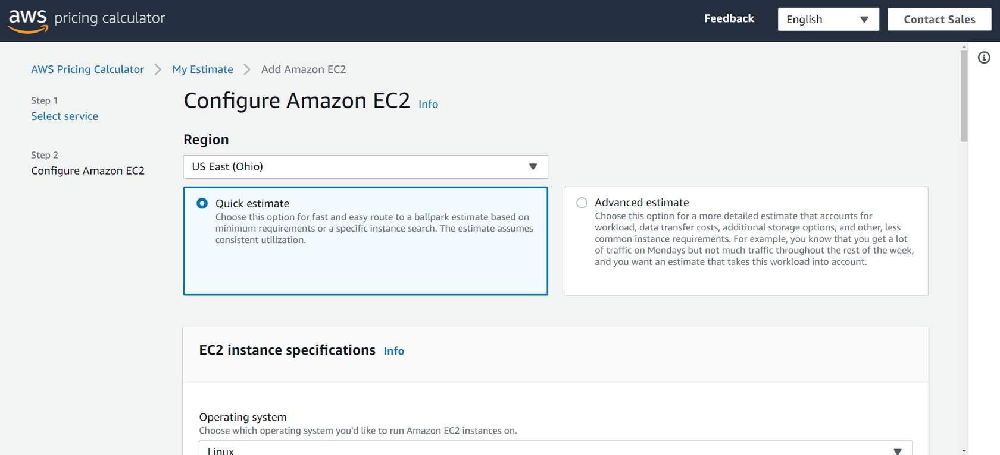

# AWS Cloud Practitioner Essentials: Pricing and Support

## Resources

[AWS Pricing](https://aws.amazon.com/pricing)
[AWS Free Tier](https://aws.amazon.com/free)
[AWS Cost Management](https://aws.amazon.com/aws-cost-management/)
[Whitepaper: How AWS Pricing Works](https://d1.awsstatic.com/whitepapers/aws_pricing_overview.pdf)
[Whitepaper: Introduction to AWS Economics](https://d1.awsstatic.com/whitepapers/introduction-to-aws-cloud-economics-final.pdf)
[AWS Support](https://aws.amazon.com/premiumsupport)
[AWS Knowledge Center](https://aws.amazon.com/premiumsupport/knowledge-center/)

## Notes

### AWS Free Tier

The [AWS Free Tier](https://aws.amazon.com/free/) enables you to begin using certain services without having to worry about incurring costs for the specified period. 

Three types of offers are available: 

* Always Free
* 12 Months Free
* Trials

For each free tier offer, make sure to review the specific details about exactly which resource types are included. 

**Always Free**
These offers *do not expire* and are available to all AWS customers.

For example, **AWS Lambda allows *1 million* free requests** and up to 3.2 million seconds of compute time per month. Amazon DynamoDB allows 25 GB of free storage per month.

**12 Months Free**
These offers are free for 12 months following your initial sign-up date to AWS.

Examples include specific amounts of Amazon S3 Standard Storage, thresholds for monthly hours of Amazon EC2 compute time, and amounts of Amazon CloudFront data transfer out.

**Trials**
Short-term free trial offers start from the date you activate a particular service. The length of each trial might vary by number of days or the amount of usage in the service.

For example, Amazon Inspector offers a 90-day free trial. Amazon Lightsail (a service that enables you to run virtual private servers) offers 750 free hours of usage over a 30-day period.

### AWS Pricing Concepts

**How AWS Pricing Works**
AWS offers a range of cloud computing services with pay-as-you-go pricing. 

* **Pay for what you use.**
  * For each service, you pay for exactly the amount of resources that you actually use, without requiring long-term contracts or complex licensing. 
* **Pay less when you reserve.**
  * Some services offer reservation options that provide a significant discount compared to On-Demand Instance pricing.
  * For example, suppose that your company is using Amazon EC2 instances for a workload that needs to run continuously. You might choose to run this workload on Amazon EC2 Instance Savings Plans, because the plan allows you to save up to 72% over the equivalent On-Demand Instance capacity.
* **Pay less with volume-based discounts when you use more.**
  * Some services offer tiered pricing, so the per-unit cost is incrementally lower with increased usage.
  * For example, the more Amazon S3 storage space you use, the less you pay for it per GB.

**AWS Pricing Calculator**
The [AWS Pricing Calculator](https://calculator.aws/#/) lets you explore AWS services and create an estimate for the cost of your use cases on AWS. You can organize your AWS estimates by groups that you define. A group can reflect how your company is organized, such as providing estimates by cost center.

When you have created an estimate, you can save it and generate a link to share it with others.

Suppose that your company is interested in using Amazon EC2. However, you are not yet sure which AWS Region or instance type would be the most cost-efficient for your use case. In the AWS Pricing Calculator, you can enter details such as the kind of operating system you need, memory requirements, and input/output (I/O) requirements. By using the AWS Pricing Calculator, you can review an estimated comparison of different EC2 instance types across AWS Regions.

**AWS Pricing Examples**
This section presents a few examples of pricing in AWS services. 

**AWS Lambda Pricing**
For AWS Lambda, you are charged based on the number of requests for your functions and the time that it takes for them to run.

AWS Lambda allows 1 million free requests and up to 3.2 million seconds of compute time per month.

You can save on AWS Lambda costs by signing up for a Compute Savings Plan. A Compute Savings Plan offers lower compute costs in exchange for committing to a consistent amount of usage over a 1-year or 3-year term. This is an example of paying less when you reserve. 

**AWS Lambda Pricing Example**
If you have used AWS Lambda in multiple AWS Regions, you can view the itemized charges by Region on your bill. 

In this example, all the AWS Lambda usage occurred in the Northern Virginia Region. The bill lists separate charges for the number of requests for functions and their duration. 

Both the number of requests and the total duration of requests in this example are under the thresholds in the AWS Free Tier, so the account owner would not have to pay for any AWS Lambda usage in this month.

**Amazon EC2 Pricing**
With Amazon EC2, you pay for only the compute time that you use while your instances are running.

For some workloads, you can significantly reduce Amazon EC2 costs by using Spot Instances. For example, suppose that you are running a batch processing job that is able to withstand interruptions. Using a Spot Instance would provide you with up to 90% cost savings while still meeting the availability requirements of your workload.

You can find additional cost savings for Amazon EC2 by considering Savings Plans and Reserved Instances.

**Amazon EC2 Pricing Example**
The service charges in this example include details for the following items:

Each Amazon EC2 instance type that has been used

The amount of Amazon EBS storage space that has been provisioned

The length of time that Elastic Load Balancing has been used

In this example, all the usage amounts are under the thresholds in the AWS Free Tier, so the account owner would not have to pay for any Amazon EC2 usage in this month.

**Amazon S3 Pricing**
For Amazon S3 pricing, consider the following cost components:

* **Storage** - You pay for only the storage that you use. You are charged the rate to store objects in your Amazon S3 buckets based on your objects’ sizes, storage classes, and how long you have stored each object during the month.
* **Requests and data retrievals** - You pay for requests made to your Amazon S3 objects and buckets. For example, suppose that you are storing photo files in Amazon S3 buckets and hosting them on a website. Every time a visitor requests the website that includes these photo files, this counts towards requests you must pay for.
* **Data transfer** - There is no cost to transfer data between different Amazon S3 buckets or from Amazon S3 to other services within the same AWS Region. However, you pay for data that you transfer into and out of Amazon S3, with a few exceptions. There is no cost for data transferred into Amazon S3 from the internet or out to Amazon CloudFront. There is also no cost for data transferred out to an Amazon EC2 instance in the same AWS Region as the Amazon S3 bucket.
* **Management and replication** - You pay for the storage management features that you have enabled on your account’s Amazon S3 buckets. These features include Amazon S3 inventory, analytics, and object tagging.

**Amazon S3 Pricing Example**
The AWS account in this example has used Amazon S3 in two Regions: Northern Virginia and Ohio. For each Region, itemized charges are based on the following factors:

* The number of requests to add or copy objects into a bucket
* The number of requests to retrieve objects from a bucket
* The amount of storage space used

All the usage for Amazon S3 in this example is under the AWS Free Tier limits, so the account owner would not have to pay for any Amazon S3 usage in this month.

### Billing Dashboard

### Consolidated Billing

### AWS Budgets

### AWS Cost Explorer

### AWS Support Plans

### AWS Marketplace
