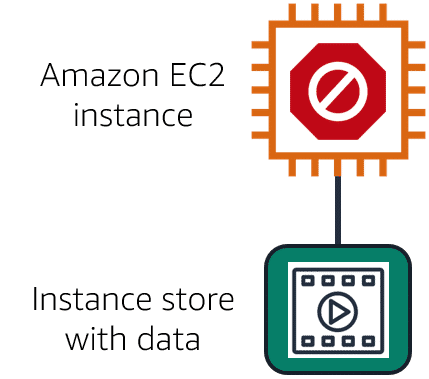
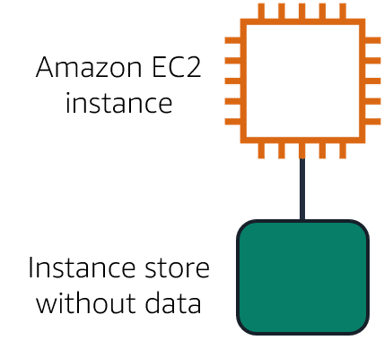
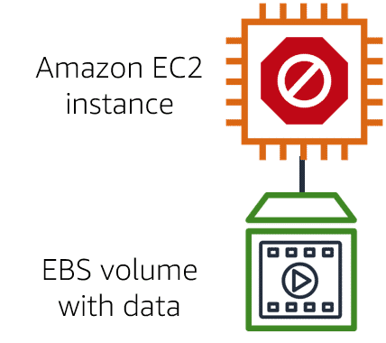

# AWS Cloud Practitioner Essentials: Storage and Databases

## Resources

## Notes

### Instance Stores and Amazon Elastic Block Store (Amazon EBS)

**Instance stores**

Block-level storage volumes behave like physical hard drives.

An [instance](https://docs.aws.amazon.com/AWSEC2/latest/UserGuide/InstanceStorage.html) store provides temporary block-level storage for an Amazon EC2 instance. An instance store is disk storage that is physically attached to the host computer for an EC2 instance, and therefore has the same lifespan as the instance. When the instance is terminated, you lose any data in the instance store. 

Instance store is ideal for temporary storage of information that changes frequently, such as buffers, caches, scratch data, and other temporary content. It can also be used to store temporary data that you replicate across a fleet of instances, such as a load-balanced pool of web servers.

An Amazon EC2 instance with an attached instance store is running.

The instance is stopped or terminated.

All data on the attached instance store is deleted.

**Amazon Elastic Block Storage (Amazon EBS)**

[Amazon Elastic Block Store (Amazon EBS)](https://aws.amazon.com/ebs) is a service that provides block-level storage volumes that you can use with Amazon EC2 instances. If you stop or terminate an Amazon EC2 instance, all the data on the attached EBS volume remains available.

To create an EBS volume, you define the configuration (such as volume size and type) and provision it. After you create an EBS volume, it can attach to an Amazon EC2 instance.

Because EBS volumes are for data that needs to persist, it’s important to back up the data. You can take incremental backups of EBS volumes by creating Amazon EBS snapshots.

**Amazon EBS Snapshots**

An EBS snapshot is an incremental backup. This means that the first backup taken of a volume copies all the data. For subsequent backups, only the blocks of data that have changed since the most recent snapshot are saved. 

Incremental backups are different from full backups, in which all the data in a storage volume copies each time a backup occurs. The full backup includes data that has not changed since the most recent backup.

### Amazon Simple Storage Service (Amazon S3)

**Object Storage**

In object storage, each object consists of data, metadata, and a key.

The data might be an image, video, text document, or any other type of file. Metadata contains information about what the data is, how it is used, the object size, and so on. An object’s key is its unique identifier.

Recall that when you modify a file in block storage, only the pieces that are changed are updated. When a file in object storage is modified, the entire object is updated.

**Amazon Simple Storage Service (Amazon S3)**

[Amazon Simple Storage Service (Amazon S3)](https://aws.amazon.com/s3/) is a service that provides object-level storage. Amazon S3 stores data as objects in buckets.

You can upload any type of file to Amazon S3, such as images, videos, text files, and so on. For example, you might use Amazon S3 to store backup files, media files for a website, or archived documents. Amazon S3 offers unlimited storage space. The maximum file size for an object in Amazon S3 is 5 TB.

When you upload a file to Amazon S3, you can set permissions to control visibility and access to it. You can also use the Amazon S3 versioning feature to track changes to your objects over time.

**Amazon S3 Storage Classes**

With Amazon S3, you pay only for what you use. You can choose from a [range of storage classes](https://aws.amazon.com/s3/storage-classes) to select a fit for your business and cost needs. When selecting an Amazon S3 storage class, consider these two factors:

* How often you plan to retrieve your data
* How available you need your data to be

**Amazon S3 Standard**

* Designed for frequently accessed data
* Stores data in a minimum of three Availability Zones

Amazon S3 Standard provides high availability for objects. This makes it a good choice for a wide range of use cases, such as websites, content distribution, and data analytics. Amazon S3 Standard has a higher cost than other storage classes intended for infrequently accessed data and archival storage.

**Amazon S3 Standard-Infrequent Access (S3 Standard-IA)**

* Ideal for infrequently accessed data
* Similar to Amazon S3 Standard but has a lower storage price and higher retrieval price

Amazon S3 Standard-IA is ideal for data infrequently accessed but requires high availability when needed. Both Amazon S3 Standard and Amazon S3 Standard-IA store data in a minimum of three Availability Zones. S3 Standard-IA provides the same level of availability as Amazon S3 Standard but with a lower storage price and a higher retrieval price.

**Amazon S3 One Zone-Infrequent Access (S3 One Zone-IA)**

* Stores data in a single Availability Zone
* Has a lower storage price than Amazon S3 Standard-IA

Compared to Amazon S3 Standard and Amazon S3 Standard-IA, which store data in a minimum of three Availability Zones, Amazon S3 One Zone-IA stores data in a single Availability Zone. This makes it a good storage class to consider if the following conditions apply:

* You want to save costs on storage.
* You can easily reproduce your data in the event of an Availability Zone failure.

**Amazon S3 Intelligent-Tiering**

* Ideal for data with unknown or changing access patterns
* Requires a small monthly monitoring and automation fee per object

In the Amazon S3 Intelligent-Tiering storage class, Amazon S3 monitors objects’ access patterns. If you haven’t accessed an object for 30 consecutive days, Amazon S3 automatically moves it to the infrequent access tier, Amazon S3 Standard-IA. If you access an object in the infrequent access tier, Amazon S3 automatically moves it to the frequent access tier, Amazon S3 Standard.

**Amazon S3 Glacier Instant Retrieval**

* Works well for archived data that requires immediate access
* Can retrieve objects within a few milliseconds

When you decide between the options for archival storage, consider how quickly you must retrieve the archived objects. You can retrieve objects stored in the Amazon S3 Glacier Instant Retrieval storage class within milliseconds, with the same performance as Amazon S3 Standard.

**Amazon S3 Glacier Flexible Retrieval**

* Low-cost storage designed for data archiving
* Able to retrieve objects within a few minutes to hours

Amazon S3 Glacier Flexible Retrieval is a low-cost storage class that is ideal for data archiving. For example, you might use this storage class to store archived customer records or older photos and video files.

**Amazon S3 Glacier Deep Archive**

* Lowest-cost object storage class ideal for archiving
* Able to retrieve objects within 12 hours

Amazon S3 Deep Archive supports long-term retention and digital preservation for data that might be accessed once or twice in a year. This storage class is the lowest-cost storage in the AWS Cloud, with data retrieval from 12 to 48 hours. All objects from this storage class are replicated and stored across at least three geographically dispersed Availability Zones.

**Amazon S3 Outposts**

* Creates S3 buckets on Amazon S3 Outposts
* Makes it easier to retrieve, store, and access data on AWS Outposts

Amazon S3 Outposts delivers object storage to your on-premises AWS Outposts environment. Amazon S3 Outposts is designed to store data durably and redundantly across multiple devices and servers on your Outposts. It works well for workloads with local data residency requirements that must satisfy demanding performance needs by keeping data close to on-premises applications.

### Amazon Elastic File System (Amazon EFS)

### Amazon Relational Database Service (Amazon RDS)

### Amazon DynamoDB

### Amazon Redshift

### AWS Database Migration Service (AWS DMS)

### Additional AWS Database Services
